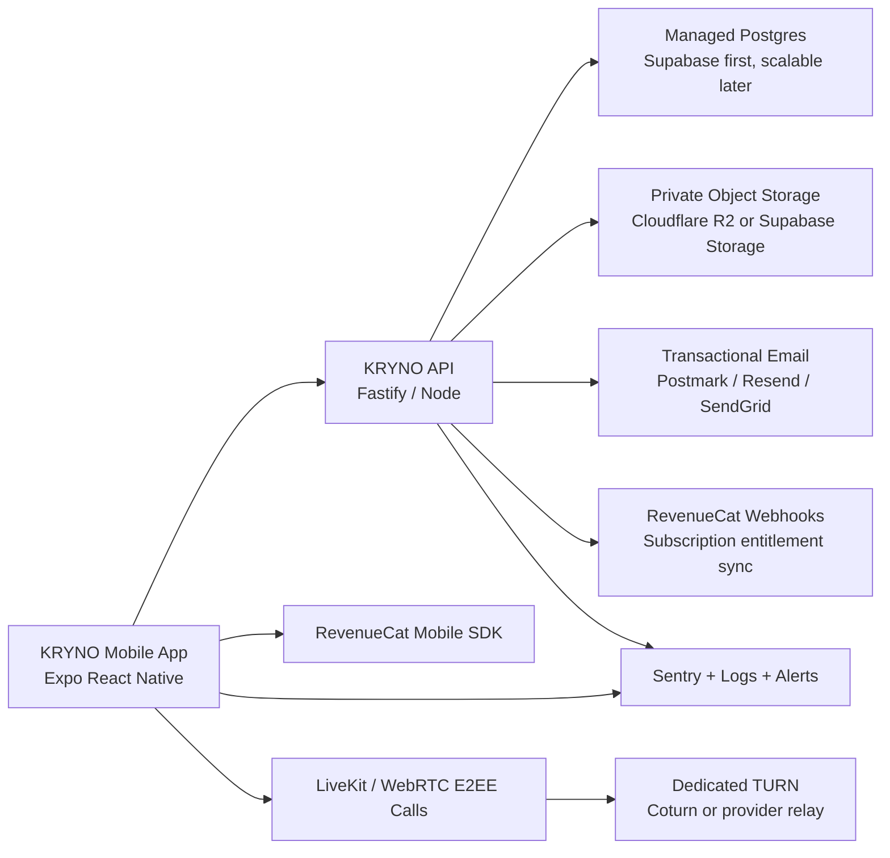

# KRYNO Production Architecture

## Goal

KRYNO should ship as a mobile-first paid social and private messaging app. The production target is not a web demo, Cloudflare quick tunnel, or laptop backend. Those remain temporary development tools only.

The first production line is:

- Mobile app: Expo React Native in `mobile-kryno-ui-raw`
- API backend: Fastify/Node in `backend`
- Database: managed Postgres
- Object storage: S3-compatible private media storage
- Calls: dedicated realtime call infrastructure with TURN fallback
- Payments: App Store / Play Store subscriptions managed through RevenueCat
- Monitoring: crash/error monitoring and operational alerts

## Current Repo Reality

The app already has useful building blocks:

- Argon2id password hashing.
- Access and refresh tokens with refresh-token rotation.
- Device sessions.
- Email verification and password reset OTPs using an HMAC pepper.
- Postgres persistence.
- Direct message encryption compatibility in the mobile layer.
- Media validation using payload checks, not only file extensions.
- Social profile, feed, story, follow, comments, and likes backend routes.
- WebRTC signaling and configurable ICE server endpoint.

The main production gaps are:

- No permanent hosted backend configured.
- Local disk media storage is still the default.
- Dedicated TURN/LiveKit call infrastructure is not fully integrated.
- RevenueCat subscriptions are not integrated.
- Monitoring and release observability are not wired.
- The mobile build still needs a permanent production API URL at build time.

## Production Topology

## Provider Decisions

Use this as the practical beta-to-production stack:

- Database: Supabase Postgres for the first months because it gives managed Postgres, backups, dashboard, and an upgrade path.
- Media: Cloudflare R2 for posts, stories, profile photos, and encrypted attachments. Supabase Storage is acceptable for beta if we want fewer moving parts, but R2 is cleaner for large media cost control.
- Calls: LiveKit with E2EE for the production call layer, plus dedicated TURN. If we keep raw WebRTC, we must still use dedicated Coturn, not public relay.
- Payments: RevenueCat to manage App Store and Google Play subscriptions and entitlements.
- Builds: EAS Build for Android/iOS.
- Monitoring: Sentry for mobile crashes and backend exceptions.
- Edge/DNS: Cloudflare DNS/WAF in front of the API once we have a permanent domain.

Official references:

- Supabase pricing: https://supabase.com/pricing
- Cloudflare R2 pricing: https://developers.cloudflare.com/r2/pricing/
- LiveKit pricing: https://livekit.io/pricing
- RevenueCat pricing: https://www.revenuecat.com/pricing/
- Expo EAS: https://expo.dev/eas
- Sentry pricing: https://sentry.io/pricing/

## Security Model

### Authentication

- Passwords stay Argon2id hashed.
- Access tokens stay short lived.
- Refresh tokens stay rotated and device-bound.
- OTPs stay HMAC-peppered, rate-limited, attempt-limited, and short-lived.
- Production must never expose OTP previews.
- Long-term improvement: move refresh tokens to secure HttpOnly cookie for web, keep SecureStore for mobile native.

### Messaging

- Message content should be encrypted on-device before it leaves the app.
- The server should only relay ciphertext and delivery metadata.
- Device identity must be explicit: each app install has its own device session and key material.
- Future improvement: complete a real Signal-style double-ratchet implementation with prekeys, signed prekeys, session repair, and device verification UI.

### Attachments

- Direct chat attachments should be client-encrypted before upload.
- Server stores encrypted bytes only.
- File names are sanitized and storage keys are UUID-based.
- Production storage should be private object storage with signed URLs or backend streaming, not executable server folders.

### Social Media

- Posts, stories, profile pictures, and public feed media are not end-to-end encrypted because they are social surfaces.
- They must still be validated, renamed, scanned where possible, and stored in object storage.
- Private-circle social content can be access-controlled, but not truly E2EE until a group-key system is implemented.

### Calls

- Signaling goes through KRYNO backend or LiveKit token service.
- Media should be E2EE in the call layer.
- Production calls require dedicated TURN or a managed provider. Public relay is not production-grade.
- Call state must distinguish ringing, connecting, connected, reconnecting, failed, cancelled, missed, and ended.

## Environment Rules

Development may use:

- `http://127.0.0.1:8080`
- LAN IP for phone testing
- temporary Cloudflare quick tunnels

Production must use:

- permanent HTTPS API domain
- managed Postgres with SSL
- unique high-entropy JWT secrets
- separate OTP pepper
- real SMTP provider
- dedicated TURN/LiveKit credentials
- no localhost or trycloudflare URLs in shipped builds

The backend now enforces these rules when `APP_ENV=production`.
The mobile Expo config also fails production builds when `EXPO_PUBLIC_KRYNO_API_URL` is missing or points to localhost / a temporary Cloudflare tunnel.

## Media Storage Implementation

The backend has a storage adapter boundary so development and production no longer need the same storage target:

- `MEDIA_STORAGE_DRIVER=local` stores files under the existing local storage folders for laptop testing.
- `MEDIA_STORAGE_DRIVER=s3` stores files in an S3-compatible bucket such as Cloudflare R2.
- Social media public URLs are generated through the storage adapter, so CDN/R2 URLs can be returned directly to the mobile app.
- Direct chat attachments continue to be stored as encrypted bytes and are read through the backend authorization layer.

## Release Workflow

1. Develop locally with backend and mobile.
2. Test on phone through LAN IP or temporary tunnel.
3. Deploy backend to staging on a permanent HTTPS domain.
4. Run `npm run db:migrate` against the staging database.
5. Build internal Android/iOS with `EXPO_PUBLIC_KRYNO_API_URL` pointing to staging.
6. Run smoke tests: auth, feed, upload, chat, call, profile, subscriptions.
7. Run `npm run db:migrate` against the production database.
8. Deploy production backend.
9. Build signed store binaries with production env.
10. Submit to Play Store and App Store.

## Subscription Entitlements

KRYNO now has a backend entitlement boundary for paid access:

- RevenueCat webhook events are recorded in `billing_webhook_events`.
- Current user subscription state is stored in `user_subscriptions`.
- The mobile app can fetch the server-side entitlement from `/api/billing/me`.
- RevenueCat must be configured to use the KRYNO user id as `app_user_id`, so webhook events map cleanly to backend users.
- Premium feature gates should use backend entitlement checks, not only client-side UI flags.

## Managed Calls Boundary

KRYNO now has a backend boundary for LiveKit calls:

- Authenticated mobile clients request `/api/calls/livekit-token`.
- The backend validates the current device session and optional recipient lookup.
- The backend issues a short-lived LiveKit room token.
- Production config requires LiveKit URL, API key, and API secret.
- The existing raw WebRTC relay remains a temporary fallback during migration.

The next implementation step is to install the LiveKit React Native client in `mobile-kryno-ui-raw`, connect to the room from the call UI, and enable LiveKit E2EE using client-held keys.

## Operations

The backend exposes:

- `/api/health` for lightweight liveness checks.
- `/api/ready` for database readiness checks.
- Sentry exception capture when `SENTRY_DSN` is configured.

Production must run migrations before booting the API. Development still auto-applies `schema.sql` for convenience, but production does not mutate schema on process start.

## What We Should Not Do

- Do not ship APKs that depend on Metro.
- Do not ship APKs pointing to a dead Cloudflare tunnel.
- Do not keep user-uploaded production media on laptop/local disk.
- Do not use public TURN relay for paid users.
- Do not add more UI rewrites before the mobile architecture is stable.
- Do not put backend secrets in the mobile app.
